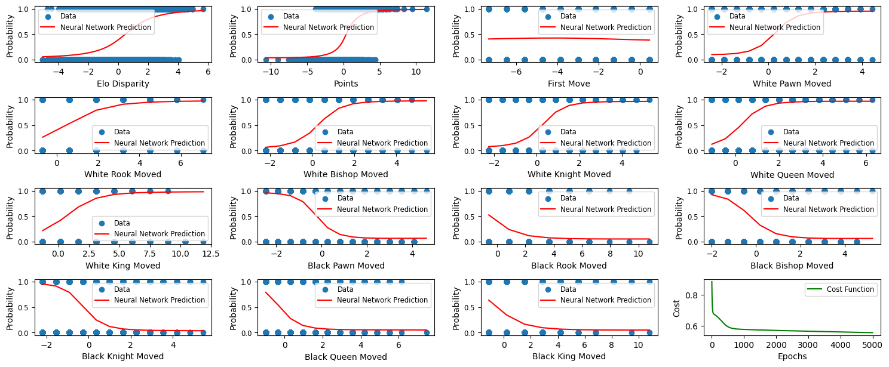
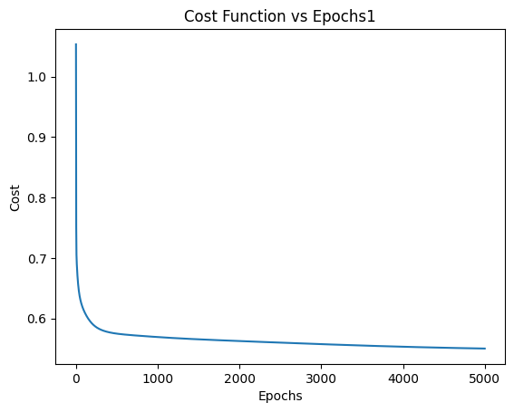
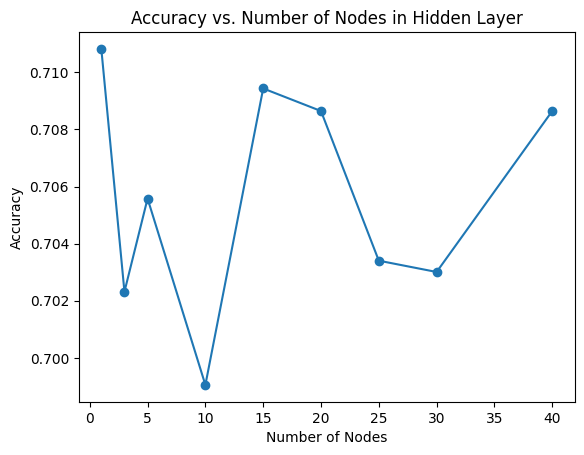

# Machine-Learning-Project-Year-3
Feed Forward Neural Network based on a simple perceptron-architecture for binary tasks. The model was applied to galaxy classification datasets, house price prediction, chess game data. We explore its generability and robustness.

  
Cost function decrease during training. Finding the optimal number of nodes.

  

    
    
  

